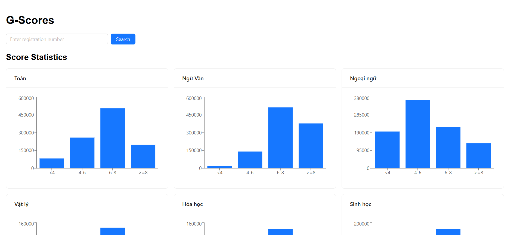
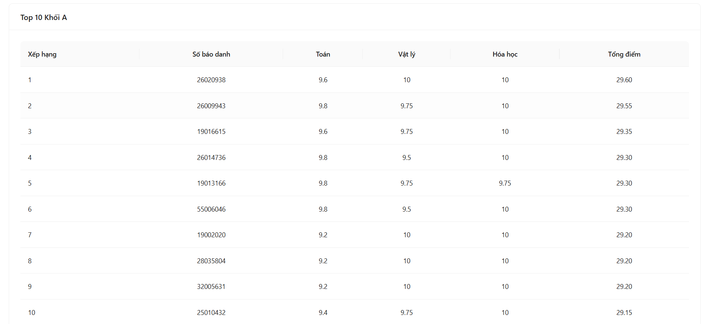

# G-Scores
A full-stack web app to check Vietnam exam scores. Users can search by ID, see charts, and view the top 10 students of Group A.

## Live Demo
*   **Frontend:** https://g-scores-tau.vercel.app/
*   **Backend API:** https://g-scores-9mfd.onrender.com



## What it can do (Features)
### 1. Find Student Scores
*   Search by student ID (SBD).
*   Show all subject scores.
*   Show 404 error if ID is wrong.
### 2. Show Charts (Stats)
*   Show score charts for all subjects.
*   4 groups of scores: less than 4, 4-6, 6-8, and 8 or more.
*   Use Recharts to make good bars.
### 3. Top 10 Group A
*   Rank top 10 students by Math, Physics, Chemistry total scores.
### 4. Import Data
*   Put data from a CSV file into MySQL database with one command:
    ```bash
    npm run import
    ```

## Tech Stack
### Frontend
*   React, Vite, React Router DOM, Axios, Ant Design, Recharts.
### Backend
*   Node.js, Express.js, Sequelize ORM, csv-parser, dotenv.
### Database
*   MySQL.

## Project Structure
```text
g-scores
│
├── backend
│   ├── dataset
│   ├── src
│   │   ├── config
│   │   ├── controllers
│   │   ├── models
│   │   ├── routes
│   │   ├── scripts
│   │   └── validators
│   ├── .env.example
│   └── package.json
│
├── frontend
│   ├── public
│   ├── src
│   │   ├── api
│   │   ├── pages
│   │   └── routes
│   ├── .env.example
│   └── package.json
│
└── README.md
```

## What you need (Prerequisites)
*   Node.js 18 or higher
*   MySQL 8 or higher
*   npm

## How to Setup and Run
You can run this project with **Docker** or **Manually**.
### Option 1: Run with Docker (Recommended)
**Prerequisites:** Open **Docker Desktop** first.
1. **Clone project and go to the folder:**
   ```bash
   git clone https://github.com/Ginas559/G-Scores.git
   cd G-Scores
   ```
2. **Setup Env Files (Important):**
   Create `.env` files from `.env.example` before building.
   * Go to `backend/` folder, copy `.env.example` to `.env` and fill your database info.
   * Go to `frontend/` folder, copy `.env.example` to `.env` and set `VITE_API_URL=http://localhost:3000`.
3. **Start the app:**
   Open terminal at `G-Scores` root folder and run:
   ```bash
   docker compose up -d --build
   ```
4. **Open the app:**
   * Go to your browser: `http://localhost:5173`
5. **Stop the app:**
   ```bash
   docker compose down
   ```
### Option 2: Run Manually
### 1. Clone this project
```bash
git clone https://github.com/Ginas559/G-Scores.git
cd G-Scores
```
### 2. Install packages
*   **Backend:**
    ```bash
    cd backend
    npm install
    ```
*   **Frontend:**
    ```bash
    cd ../frontend
    npm install
    ```
### 3. Setup Env Files
You need to create `.env` files. Look at `.env.example` files to do it.
*   **In `backend/` folder:**
    Copy `.env.example` to `.env` and fill it:
    ```env
    DB_NAME=your_db_name
    DB_USER=your_db_user
    DB_PASSWORD=your_db_password
    DB_HOST=127.0.0.1
    DB_PORT=3306
    ```
*   **In `frontend/` folder:**
    Copy `.env.example` to `.env`.
    *   For Local: `VITE_API_URL=http://localhost:3000`
    *   For Production: `VITE_API_URL=https://g-scores-9mfd.onrender.com`
### 4. Run App (Local)
*   **Start Backend:**
    ```bash
    cd backend
    npm run dev
    ```
*   **Import Data (Do this next):**
    ```bash
    cd backend
    npm run import
    ```
*   **Start Frontend:**
    ```bash
    cd frontend
    npm run dev
    ```

## API Endpoints
### Quick Links to Test:
*   **Get Stats:** `GET https://g-scores-9mfd.onrender.com/report`
*   **Get Top 10:** `GET https://g-scores-9mfd.onrender.com/top10/group-a`
*   **Get 1 Student:** `GET https://g-scores-9mfd.onrender.com/students/01000001`
### Summary Table:
| Method | URL | What it does |
| :--- | :--- | :--- |
| **GET** | `/students/:sbd` | Find a student by ID |
| **GET** | `/report` | Get charts data |
| **GET** | `/top10/group-a` | Get top 10 students |

## Important Notes
*   Always change `.env.example` to `.env` before you run the code.